<p align="center">
  
</p>

# Vibekit

<p align="center"><strong>CLI-first setup manager for vibe coders.</strong></p>

<p align="center">Local-first pack, MCP, and self-install workflow for Claude Code, OpenCode, and Codex.</p>

<p align="center">
  
  
  
  
</p>

> [!IMPORTANT]
> Vibekit is source-available for personal use only.
> Commercial use is not allowed.
> Use on company-owned or company-managed devices is not allowed.
> See `LICENSE` for the full terms.

Vibekit installs and tracks coding-assistant setup packs for Claude Code, OpenCode, and Codex. The MVP is local-first, Bash-based, and safe by default.

## Status

This is an early MVP scaffold.

Implemented:

- Tool detection
- Pack listing
- Dry-run diffs
- Safe install with backups and state tracking
- Safe uninstall by checksum
- Core Vibe Coder pack with persistent planning, implementation, research, review, and specialist workflows
- Claude Code adapter
- OpenCode adapter
- Codex adapter
- MCP installers for clean assistant config files plus matching `mcp-*` skills
- Local secret storage helper

## Quick Start

```bash
./bin/vibekit self install
vibekit doctor --shell zsh
vibekit diff core-vibe-coder --tools claude,opencode,codex --scope project
vibekit install core-vibe-coder --tools claude,opencode,codex --scope project
```

If you do not want to install a launcher yet, you can still run the repo-local script directly:

```bash
./bin/vibekit doctor --shell zsh
./bin/vibekit diff core-vibe-coder --tools claude,opencode,codex --scope project
./bin/vibekit install core-vibe-coder --tools claude,opencode,codex --scope project
```

## Install The CLI

Install a user-scoped launcher plus a self-contained runtime so `vibekit` works from any directory even if you later move or delete the clone you installed from:

```bash
./bin/vibekit self install
```

Default install target:

- `~/.local/bin/vibekit`
- runtime copy under `${XDG_DATA_HOME:-~/.local/share}/vibekit/self/`

Useful commands:

```bash
./bin/vibekit self status --shell auto
./bin/vibekit self install --force
./bin/vibekit self install --shell bash --bin-dir "$HOME/bin"
./bin/vibekit self uninstall --shell zsh
./bin/vibekit doctor --shell zsh
```

If the install bin dir is not already on your `PATH`, `vibekit self install` appends it to the default shell startup file for your shell:

- `zsh`: `~/.zprofile`
- `bash`: `~/.bash_profile` or `~/.profile`
- `fish`: `${XDG_CONFIG_HOME:-~/.config}/fish/config.fish`
- `nu`: `${XDG_CONFIG_HOME:-~/.config}/nushell/config.nu`
- `pwsh`: `~/.config/powershell/Microsoft.PowerShell_profile.ps1`

`vibekit self status` and `vibekit doctor` report:

- `shell-type`: normalized shell id used for startup-file and probe logic
- `shell-config`: startup file Vibekit would edit for that shell
- `shell-path`: whether that file already references the selected `--bin-dir`
- `fresh-shell`: whether a newly launched shell sees `vibekit` on `PATH`

When `--bin-dir` is omitted, `vibekit self status` and `vibekit doctor` prefer a Vibekit-managed launcher already on `PATH`; otherwise they fall back to `~/.local/bin`.

Then open a new terminal, or reload your shell with:

```bash
exec zsh -l
```

Re-run `./bin/vibekit self install` from a newer clone to refresh the installed runtime.

## Commands

```bash
vibekit detect
vibekit doctor [--shell auto|zsh|bash|fish|nu|pwsh] [--bin-dir DIR]
vibekit self status [--shell auto|zsh|bash|fish|nu|pwsh] [--bin-dir DIR]
vibekit self install [--shell auto|zsh|bash|fish|nu|pwsh] [--bin-dir DIR] [--force]
vibekit self uninstall [--shell auto|zsh|bash|fish|nu|pwsh] [--bin-dir DIR]
vibekit status
vibekit list packs
vibekit mcp list
vibekit diff [pack]
vibekit install [pack]
vibekit uninstall [pack]
vibekit mcp diff context7
vibekit mcp install context7
vibekit mcp uninstall context7
vibekit mcp install playwright
vibekit secrets set CONTEXT7_API_KEY
vibekit secrets unset CONTEXT7_API_KEY
```

## Safety Model

- Existing user files are skipped by default.
- `--force` is required to overwrite non-vibekit files.
- Backups are stored under `${XDG_STATE_HOME:-~/.local/state}/vibekit/backups`.
- Installed files are tracked in `${XDG_STATE_HOME:-~/.local/state}/vibekit/installed.tsv`.
- Uninstall removes only files whose checksum still matches the install record.
- Secrets are never written into project configs directly.

## Config Targets

Claude Code:

- Project: `.claude/agents`, `.claude/commands`, `.claude/skills`, `.claude/CLAUDE.md`
- Global: `~/.claude/agents`, `~/.claude/commands`, `~/.claude/skills`, `~/.claude/CLAUDE.md`

OpenCode:

- Project: `.opencode/agents`, `.opencode/commands`, `.opencode/skills`, `AGENTS.md`
- Global: `~/.config/opencode/agents`, `~/.config/opencode/commands`, `~/.config/opencode/skills`, `~/.config/opencode/AGENTS.md`

Codex:

- Project: project `AGENTS.md` plus a local Codex plugin marketplace under `${XDG_DATA_HOME:-~/.local/share}/vibekit/codex-marketplaces/vibekit/`
- Global: the same local Codex plugin marketplace without a project `AGENTS.md`

Vibekit installs Codex packs as a real Codex plugin, then runs `codex plugin add core-vibe-coder@vibekit` so Codex caches and enables the plugin. The plugin contains Codex commands, specialist agents, and skills. Codex currently reads MCP config from `~/.codex/config.toml`, not project `.codex/config.toml`, so Vibekit installs Codex MCP entries into `~/.codex/config.toml` even when `--scope project` is selected.

## MCP

`vibekit mcp install` does two things:

- Writes the assistant-specific MCP config file for Claude, OpenCode, and/or Codex.
- Installs a matching `mcp-*` skill so planning, debugging, and review flows can explicitly load the right MCP guidance when relevant.

Current registry entries:

- `context7`: official docs lookup via API key header
- `playwright`: browser automation via local stdio server
- `open-bridge`: local OpenRouter-backed reasoning, synthesis, and second-opinion analysis
- `sentry`: remote OAuth MCP for production issue investigation
- `figma`: remote OAuth MCP for design context
- `github`: remote bearer-token MCP for issues, PRs, workflows, and releases

```bash
./bin/vibekit mcp list
./bin/vibekit mcp diff context7 --tools claude,opencode,codex --scope project
./bin/vibekit mcp install context7 --tools claude,opencode,codex --scope project
./bin/vibekit mcp install sentry --tools claude,opencode,codex --scope project
./bin/vibekit mcp install github --tools claude,opencode,codex --scope project
./bin/vibekit mcp install playwright --tools claude,opencode,codex --scope project
./bin/vibekit mcp install open-bridge --tools claude,opencode,codex --scope project
./bin/vibekit mcp install figma --tools claude,opencode,codex --scope project
./bin/vibekit mcp uninstall context7 --tools claude,opencode,codex --scope project
./bin/vibekit mcp uninstall open-bridge --tools codex --scope project --purge-secrets
```

Installed MCP skills are placed alongside each assistant's normal skills:

- Claude: `.claude/skills/mcp-<name>/SKILL.md`
- OpenCode: `.opencode/skills/mcp-<name>/SKILL.md`
- Codex: `~/.codex/skills/mcp-<name>/SKILL.md`

The built-in planning, research, brainstorming, implementation, debugging, and review setup is instructed to load these skills when a task needs external docs, GitHub state, browser checks, design context, production incident data, or a second-opinion reasoning pass.

`open-bridge` requires `OPENROUTER_API_KEY` plus a local bridge runtime. During install, Vibekit also offers an `OPENROUTER_MODEL` selection and stores it in the same secrets file. The upstream project supports `pip install openrouter-mcp-bridge` and `uvx openrouter-mcp-bridge`. Vibekit now bootstraps a managed runtime under `${XDG_DATA_HOME:-~/.local/share}/vibekit/mcp-runtimes/open-bridge/`, then points the generated MCP config at a Vibekit-managed launcher that loads Vibekit's secrets file before starting the server.

Runtime bootstrap rules:

- Prefer `python3.12`, `python3.11`, or `python3.10` and install `openrouter-mcp-bridge` into a managed virtualenv.
- If a compatible Python is not available, use `uv` to install the tool with `uv tool install --python 3.10 openrouter-mcp-bridge`.
- If `uv` is missing, install a managed copy of `uv` with Astral's official installer into Vibekit's runtime directory.
- On macOS package managers, install `uv` rather than a separate `uvx` formula. `uvx` is an alias provided by `uv`.

Because the managed launcher loads `${XDG_STATE_HOME:-~/.local/state}/vibekit/secrets.env`, Claude, OpenCode, and Codex can all receive `OPENROUTER_API_KEY` and `OPENROUTER_MODEL` without relying on the shell that launched the assistant.

On MCP uninstall, Vibekit asks whether to keep stored MCP secrets for future reinstall or remove them completely. Use `--purge-secrets` for non-interactive cleanup, or `vibekit secrets unset <NAME>` to remove a single stored value.

Claude global MCP configuration is intentionally not written directly in MVP because Claude stores user/global MCP state in `~/.claude.json`. Use Claude's own command for global Claude MCP setup:

```bash
claude mcp add --transport http context7 https://mcp.context7.com/mcp
```

For Claude global Playwright MCP setup, use Claude's command:

```bash
claude mcp add --transport stdio playwright -- npx -y @playwright/mcp@latest
```

For Claude global Open Bridge MCP setup, export `OPENROUTER_API_KEY` first and then use Claude's command:

```bash
claude mcp add --transport stdio open-bridge --env OPENROUTER_API_KEY="$OPENROUTER_API_KEY" -- uvx openrouter-mcp-bridge
```

For Claude global GitHub MCP setup, use Claude's command with a PAT header:

```bash
claude mcp add --transport http github https://api.githubcopilot.com/mcp/ \
  --header "Authorization: Bearer YOUR_GITHUB_PAT"
```

For Claude global Sentry or Figma MCP setup, use Claude's command and then authenticate in `/mcp`:

```bash
claude mcp add --transport http sentry https://mcp.sentry.dev/mcp
claude mcp add --transport http figma https://mcp.figma.com/mcp
```

## Reference Corpus

The sibling `claude-config` directory is a reference corpus only. It should not be copied wholesale into arbitrary projects because it is Claude-specific, stack-biased, and includes permissive local settings.

## License

Copyright (c) 2026 `htooayelwinict`.

Vibekit is released under the `Vibekit Personal Use Only License 1.0`.

You may:

- use, copy, and modify Vibekit for your own personal, non-commercial use
- run it on devices you personally own or personally control for private use
- share original or modified copies only if the same personal-use-only terms and copyright notice stay with the code

You may not:

- use Vibekit for commercial work, internal business work, client work, or paid services
- use Vibekit on company-owned, employer-managed, or other organization-managed devices
- sell, sublicense, host, or redistribute Vibekit under different terms

See `LICENSE` for the full text.
